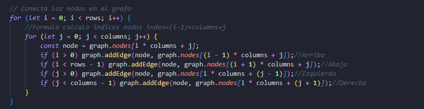

                                Trabajo Final
                    Integrantes:Karina Garcia y Diego Rivera
                    Profesor:Ing Pablo Torres

Marco Teorico
EL problema planteado fue el de resolver un laberinto usando grafos y distintos metodos de recorrido,
pensar en la manera de implementar , pero despues de analizar nuestro problema efectivamente nuestra mejor opcion
era implementar un grafo que tenga como nodos principales el nodo de fin y inicio que el usuario ingrese, es decir
los vertices y los vecinos dependeran de esos nodos debido a que definiran cuando iniciara el recorrido y cuando terminara

Explicacion Funciones
BFS
Explora el nodo grafo por grafo para encontrar la saldia mas rapida si es que esta cerca
DFS
Explora profundamente en una dirección antes de retroceder, lo que puede ser más lento si la salida está en un nivel profundo o puede llevar a explorar caminos innecesarios.
Recrusividad
Es una funcion que recorre cada noso hasta que se cumpla el caso base, que es que el nodo de inicio sea igual al de final

Cache
Se intento realizar cache siguiendo la mecanica de seguir todos los caminos y despues de encontrar el mejor recrarlo
pero al ser demasiado complejo al momento de ejecturar el script la pagina fallaba 
/*export function cache(startNode, endNode, rows, columns) {
    // Inicializar distancias y caminos anteriores
    const dist = {};
    const prev = {};
    const queue = [];
    const path = [];

    const start = startNode.value;
    const end = endNode.value;

    // Inicializar distancias a infinito y caminos anteriores a null
    for (let i = 0; i < rows; i++) {
        for (let j = 0; j < columns; j++) {
            const nodeValue = `${i}-${j}`;
            dist[nodeValue] = Infinity;
            prev[nodeValue] = null;
        }
    }

    // Configurar distancia inicial del nodo de inicio
    dist[start] = 0;
    queue.push(start);

    while (queue.length > 0) {
        const current = queue.shift();
        const [currentRow, currentCol] = current.split('-').map(Number);

        if (current === end) break;

        // Definir vecinos del nodo actual
        const neighbors = [
            `${currentRow - 1}-${currentCol}`, // arriba
            `${currentRow + 1}-${currentCol}`, // abajo
            `${currentRow}-${currentCol - 1}`, // izquierda
            `${currentRow}-${currentCol + 1}`  // derecha
        ];

        // Explorar vecinos
        for (const neighbor of neighbors) {
            const [r, c] = neighbor.split('-').map(Number);
            if (r >= 0 && r < rows && c >= 0 && c < columns) {
                if (dist[neighbor] === undefined || dist[neighbor] === Infinity) {
                    dist[neighbor] = dist[current] + 1;
                    prev[neighbor] = current;
                    queue.push(neighbor);
                }
            }
        }
    }

    // Reconstruir el camino desde el nodo final
    let step = end;
    while (step !== null) {
        path.unshift(step);
        step = prev[step];
    }

    return path.map(coord => coord.split('-').map(Number));
}
    no funciono por ser muy complejo
*/ 
Asi que se tomo un algoritmo similar al bfs usando algo de caching para poder mostrar una ruta similar 

Conclusiones 
Para este problema la mejor opcion es bfs ya que la mayoria de veces la celda de salidano esta tan lejos y con bfs se encontrara el camino mas rapido, mientras que la peor es con  programacion dinamica ya que es muy complejo para funcionar de manera correcta en este algoritmo